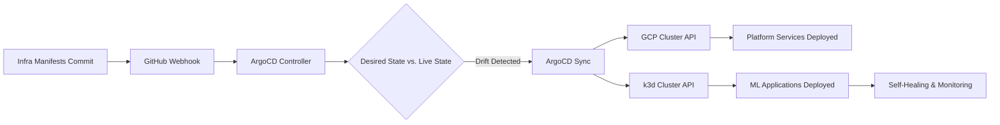

# AI-Augmented MLOps Platform - Infrastructure Manifests
## Declarative Configuration for a Hybrid Cloud-Edge MLOps Platform

[](https://argo-cd.readthedocs.io/)
[](https://opensource.org/licenses/MIT)

---

## Project Overview

This repository is the **single source of truth** for the entire AI-Augmented MLOps Platform. It contains all Kubernetes manifests and declarative configurations for the platform services and the ML application workloads.

The platform strictly adheres to **GitOps principles**, using **ArgoCD** to manage the state of two independent Kubernetes clusters: the **Cloud Control Plane (GCP)** and the **On-Premises Edge Node (k3d)**. Any change to the platform's desired state is achieved by committing a change to this repository, which ArgoCD then automatically synchronizes to the target clusters.

**Core Focus:** Demonstrating advanced skills in Platform Engineering, Multi-Cluster Management, Infrastructure as Code (IaC), and Site Reliability Engineering (SRE) through declarative configuration.

---

## Architecture


---

## Key Features (Infrastructure Focus)

### GitOps & Continuous Delivery
- **Single Source of Truth**: All cluster configurations (platform services, application deployments, monitoring rules) are defined declaratively in this repository.
- **Multi-Cluster Management**: ArgoCD, deployed on the GCP Control Plane, manages applications and platform services across both the GCP and the remote k3d cluster.
- **Automated Synchronization**: ArgoCD is configured for automated sync with prune and self-heal, ensuring the live state always matches the desired state in Git.
- **Secure Hybrid Connectivity**: Configuration leverages **Tailscale VPN** for secure, encrypted communication between the cloud and on-premises clusters.

### Platform Services as Code
- **MLflow Manifests**: Declarative deployment of the MLflow Tracking Server and Model Registry (including Persistent Volume Claims).
- **Observability Stack**: Kubernetes manifests for Prometheus, Grafana, and Alertmanager, including multi-cluster scrape configurations.
- **Application Deployment**: Declarative definition of the `iris-classifier` deployment, service, and resource limits for the k3d Edge Node.

### AI-Augmented Operations (AIOps)
- **Alerting Integration**: Manifests for Alertmanager, configured to route alerts that trigger external AI-powered analysis workflows (defined in the Model Source Repo).
- **Self-Healing Design**: The platform services (e.g., ArgoCD, Prometheus) are configured with liveness and readiness probes, and ArgoCD's self-heal ensures resilience.

### Security & Compliance (DevSecOps)
- **IaC Audit Trail**: Every infrastructure change is tracked, reviewed, and approved via Git history.
- **Resource Management**: Manifests include explicit resource `limits` and `requests` to prevent resource exhaustion and ensure stability on the constrained GCP e2-small instance.

---

## Project Structure (Infrastructure Manifests Repo)

This structure organizes the platform's declarative configuration by domain and target cluster:

```
MLOps-AI-Homelab-Infra-Manifests/
├── applications/
│   └── iris-classifier/
│       └── deployment.yaml                # ML Application Deployment, Service, and HPA manifests (k3d Cluster)
├── argocd-apps/                           # ArgoCD Application definitions (The 'App of Apps' pattern)
│   └── iris-classifier-app.yaml           # Targets the k3d cluster
├── platform/
│   ├── kserve/                            # Placeholder for KServe (model serving) manifests
│   ├── mlflow/
│   │   └── mlflow.yaml                    # MLflow Deployment, Service, and PVC manifests (GCP Cluster)
│   └── monitoring/
│       └── monitoring.yaml                 # Prometheus, Grafana, Alertmanager manifests (GCP Cluster)                
└── README.md 
```
    
---

## GitOps Deployment Workflow

The deployment process is entirely driven by commits to this repository. ArgoCD acts as the continuous delivery engine, enforcing the desired state defined in these manifests.



### Continuous Deployment Stages

1.  **Commit:** A new image tag or configuration change is committed to the `applications/iris-classifier/deployment.yaml` file (usually by the CI/CD pipeline in the Model Source Repo).
2.  **Detection:** ArgoCD, watching this repository, detects the change in the Git state.
3.  **Synchronization:** ArgoCD automatically syncs the change to the target cluster (k3d for the ML application, GCP for platform services).
4.  **Rolling Update:** Kubernetes performs a zero-downtime rolling update of the ML model pod.
5.  **Self-Healing:** If a pod fails or drifts from the manifest definition, ArgoCD automatically attempts to revert the cluster state to match the Git state.

---

## AI Integration Details (Platform Manifests Context)

The platform's intelligent operational layer is enabled by the configuration defined in these manifests, specifically the Alertmanager and the application resource definitions.

### 1. Real-Time Log Analysis
The Prometheus and Alertmanager manifests define the alert rules (e.g., `ModelPodOOMKilled`). When an alert fires, Alertmanager is configured to send a webhook that triggers the external AI workflow, which then uses the pod and event context (defined by the application's resource limits) to generate the analysis.

### 2. Model Drift Detection
The Prometheus configuration includes scrape jobs to monitor the ML application's health. Future enhancements will include a custom exporter to expose MLflow metrics, allowing Prometheus to fire an alert based on accuracy thresholds, which will then trigger the AI drift analysis workflow.

---

## Monitoring & Alerting (Manifests Defined)

The `platform/monitoring/` directory contains the declarative configuration for the entire observability stack.

### Prometheus Configuration Highlights
- **Multi-Cluster Scraping**: The `prometheus-config.yaml` includes a `static_configs` job to scrape the remote k3d cluster via its **Tailscale IP** and exposed NodePorts.
- **Alert Rules**: All SRE-focused alert rules (e.g., resource utilization, pod health) are defined in the Prometheus configuration.

### Alertmanager Configuration Highlights
- **Webhook Receiver**: Configured to route critical alerts to a webhook endpoint (future service) that will automatically trigger the `ai-log-analysis.yml` GitHub Actions workflow.

---

## Skills Showcase

### Platform Engineering
- **Multi-Cluster Kubernetes Management**: Designing and implementing a control plane (GCP) to manage a remote data plane (k3d).
- **Hybrid Cloud Architecture**: Utilizing Tailscale VPN to bridge cloud and on-premises infrastructure securely.
- **Infrastructure as Code (IaC)**: 100% of the platform is defined declaratively in Kubernetes manifests.

### GitOps & Continuous Delivery
- **ArgoCD Mastery**: Implementing multi-cluster ArgoCD with automated sync, prune, and self-heal policies.
- **Declarative Configuration**: Writing robust, portable Kubernetes YAML for all platform services.

### Site Reliability Engineering (SRE)
- **Observability Implementation**: Deploying and configuring a multi-cluster Prometheus/Grafana stack.
- **Resource Management**: Applying strict resource limits and requests for stability on constrained hardware.
- **Incident Response Automation**: Configuring Alertmanager to integrate with AI-powered incident triage workflows.

---

## Repository Links

- **Infrastructure Manifests Repo**: [MLOps-AI-Homelab-Infra-Manifests](https://github.com/Dycouzt/MLOps-AI-Homelab-Infra-Manifests)
- **Model Source Repo**: [MLOps-AI-Homelab-Model-Source](https://github.com/Dycouzt/MLOps-AI-Homelab-Model-Source)

---

## Quick Start (Infrastructure Deployment)

This guide focuses on deploying the core platform services and registering the remote cluster using the manifests in this repository.

### Prerequisites
- GCP VM running k3s (Control Plane)
- k3d cluster running on Windows/WSL2 (Edge Node)
- Tailscale VPN configured on both nodes
- `kubectl` and `argocd` CLI installed

### Setup Instructions

1.  **Deploy ArgoCD (on GCP Control Plane)**
    ```bash
    # Create namespace and install ArgoCD
    kubectl create namespace argocd
    kubectl apply -n argocd -f \
      https://raw.githubusercontent.com/argoproj/argo-cd/stable/manifests/install.yaml
    
    # Get initial admin password
    ARGO_PASS=$(kubectl -n argocd get secret argocd-initial-admin-secret -o jsonpath="{.data.password}" | base64 -d)
    echo "ArgoCD Password: $ARGO_PASS"
    ```

2.  **Register On-Premises k3d Cluster**
    The k3d cluster must be registered with ArgoCD using its **Tailscale IP** for secure, cross-cluster communication.
    ```bash
    # Ensure your k3d kubeconfig is configured to use the Tailscale IP
    # The k3d cluster must have been created with the --tls-san flag for the Tailscale IP
    
    # Add the k3d cluster to ArgoCD 
    argocd cluster add <CLUSTER_NAME>
    ```

3.  **Deploy Platform Services via GitOps**
    The `argocd-apps/platform-apps.yaml` manifest defines the ArgoCD Application that deploys all platform services (MLflow, Prometheus, Grafana) to the GCP cluster.
    ```bash
    # Apply the ArgoCD Application definition
    kubectl apply -f argocd-apps/platform-apps.yaml
    
    # ArgoCD will now automatically sync the platform/mlflow and platform/monitoring directories
    # to the GCP cluster, establishing the control plane services.
    ```

4.  **Deploy ML Application via GitOps**
    The `argocd-apps/iris-classifier-app.yaml` manifest targets the remote `k3d-ml-worker` cluster.
    ```bash
    # Apply the ArgoCD Application definition
    kubectl apply -f argocd-apps/iris-classifier-app.yaml
    
    # ArgoCD will now sync the applications/iris-classifier directory to the k3d cluster,
    # deploying the model inference service to the edge node.
    ```

---

## Repository Links

- **Model Source Repo**: [MLOps-AI-Homelab-Model-Source](https://github.com/Dycouzt/MLOps-AI-Homelab-Model-Source)
- **Infrastructure Manifests**: [MLOps-AI-Homelab-Infra-Manifests](https://github.com/Dycouzt/MLOps-AI-Homelab-Infra-Manifests)


## Documentation
- See the docs/ folder in the model source repository for detailed documentation.

---

## Acknowledgments

- **ArgoCD Team**: For GitOps excellence
- **MLflow Community**: For ML lifecycle tools
- **Prometheus/Grafana**: For observability infrastructure
- **Google Cloud**: For Gemini AI API
- **CNCF**: For Kubernetes and cloud-native ecosystem

---

## Author

**Dycouzt** - Diego Acosta